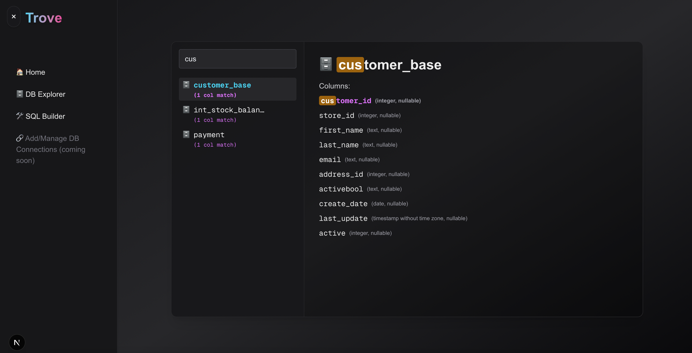

# 🔑 trove

**Trove** is a treasure chest for your startup's data. It's an open source data exploration and observability tool made for *everyone*—PMs, EMs, marketers, partner teams, and engineers alike.

Forget per-seat pricing, clunky dashboards, and gatekeeping. With Trove, your whole crew can pull, explore, and share insights from your data—fast, friendly, and free.

> **💡 Built for startups.**  
> No heavy setup, no complex roles (unless you want that), just data when and where you need it.

---

## ✨ What trove does

- 🔍 **Explore your data** – Navigate schemas and tables like a map.
- 🧾 **Query with SQL** – Or don't! You can always use the visual query builder or ask AI 😉
- 🧑‍🤝‍🧑 **Made for teams** – Built for cross-functional folks, not just data engineers.
- 💻 **Clean, modern UI** – Feels good for everyone, tech or not.
- 🛠️ **Open source & extensible** – Apache 2.0 licensed and ready to hack.

---

## 🧭 Demo

  

---

## 📚 Documentation

Check out our [comprehensive documentation](./docs/README.md) to learn more about:
- Getting Started Guide
- Architecture Overview
- Development Guide
- API Reference
- Deployment Instructions

---

## 🗺️ Roadmap

**Currently Available**
- Schema and table discovery
- SQL editor with results viewer
- Postgres connector
- Visual query builder

**Coming Soon**
- Query history, saving, and sharing
- AI-assisted data questions
- dbt metadata integration
- More database connectors (BigQuery, Snowflake, etc.)

---

## 🤝 Contributing

Trove is in early development—and growing fast. If you're excited about making data easier for teams, we'd love your help!

Check out [CONTRIBUTING.md](CONTRIBUTING.md) to get started.

---

## 📄 License

Trove is [Apache 2.0 licensed](LICENSE). It's free to use, fork, and modify.  
We may offer a hosted version in the future—but the open source core will always stay open.

---

**Dig into your data. Share what you find.**  
**This is your trove.**
