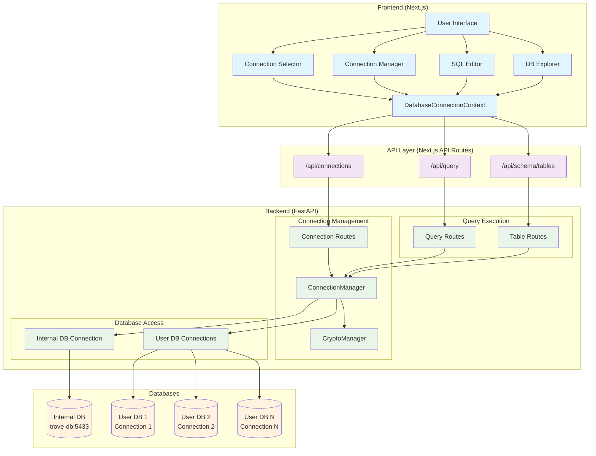
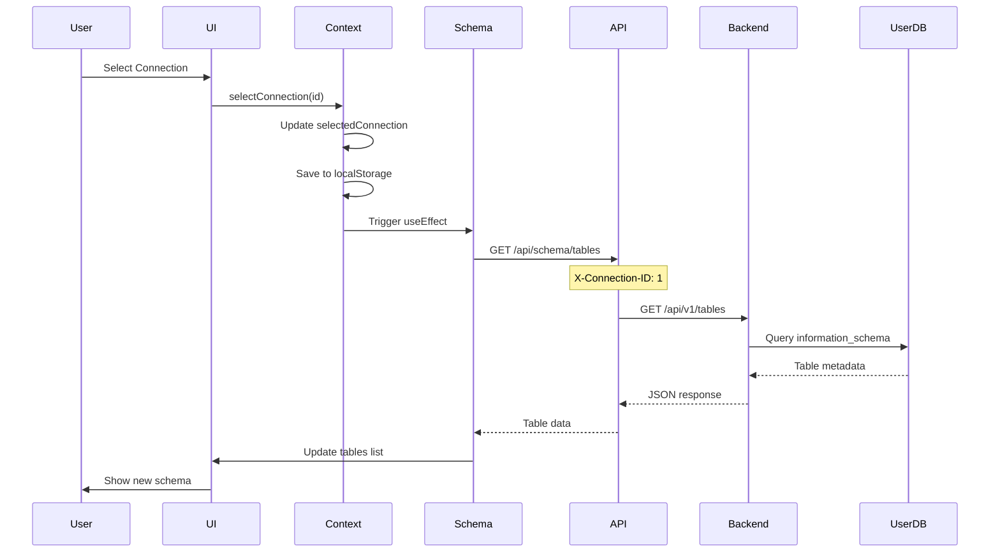
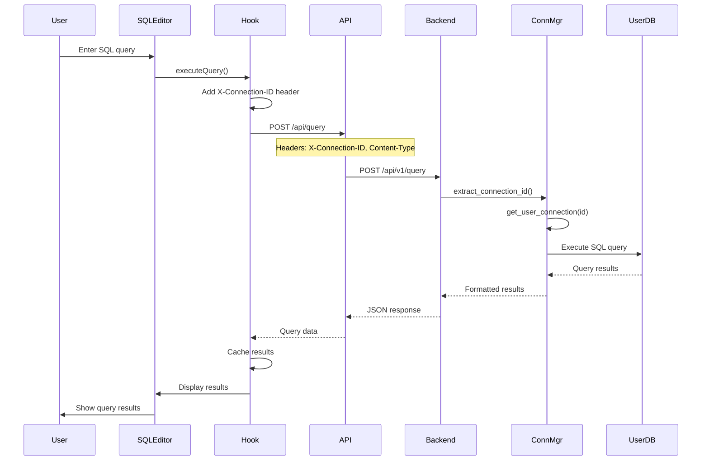
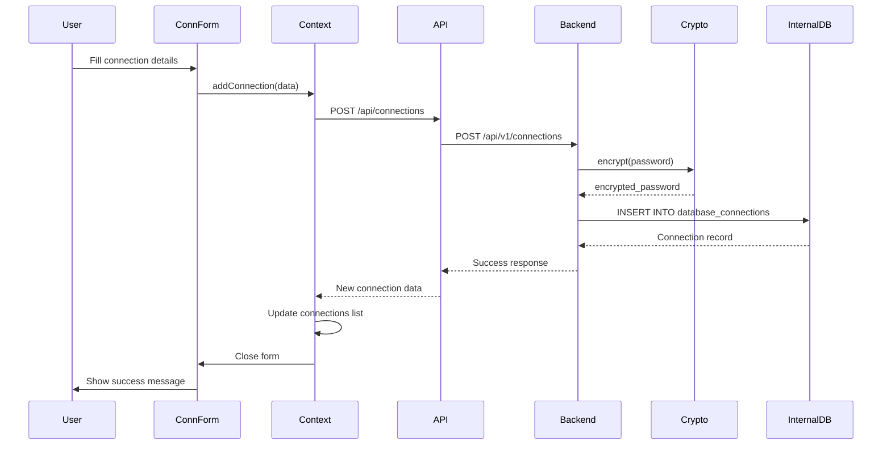
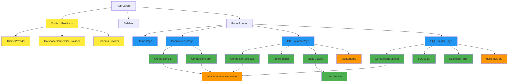
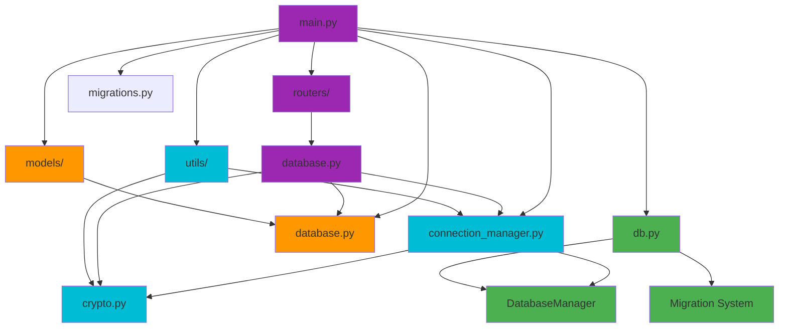
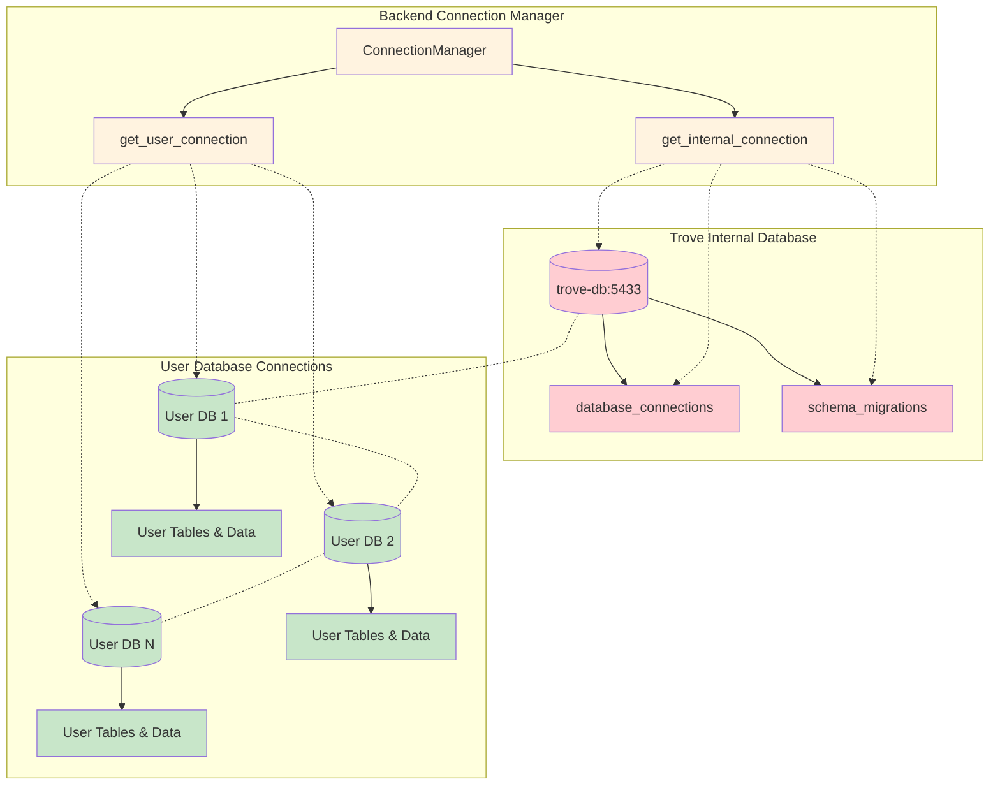
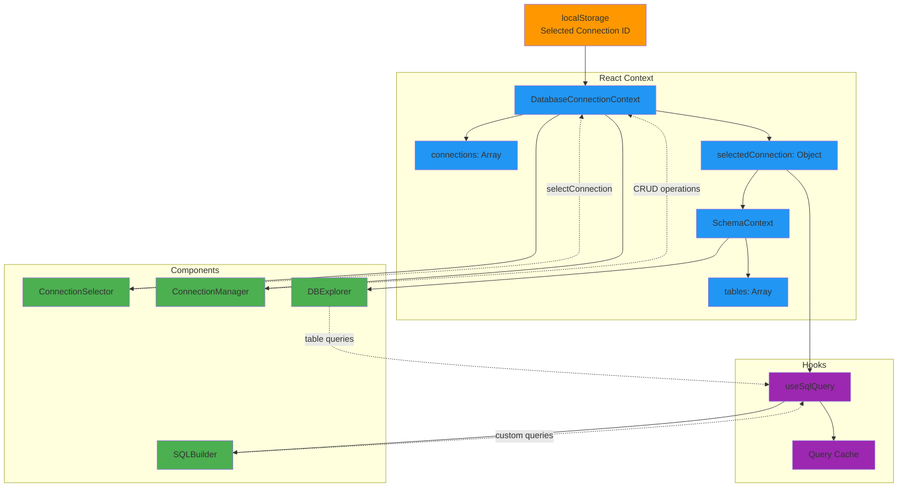

# Architecture & Data Flow 🏗️

## How Everything Fits Together

## What Happens When You Click Things

### Switching Connections (The Magic ✨)

### Running Queries (The Fun Part 🚀)

### Adding New Connections (The Setup 🔐)

## Component Tree (The Family 👨‍👩‍👧‍👦)

### How React Components Are Related

### Backend File Organization (The Grown-ups 🐍)

## Security Stuff (The Important Bits 🔒)

### How We Keep Your Passwords Safe

```mermaid
graph LR
    subgraph "Frontend"
        Form[Connection Form]
        PlainPW[Plain Password]
    end
    
    subgraph "API Transport"
        HTTPS[HTTPS Transport]
        Encrypted[Encrypted Channel]
    end
    
    subgraph "Backend Processing"
        Receive[Receive Password]
        FernetEnc[Fernet Encryption]
        EncryptedPW[Encrypted Password]
    end
    
    subgraph "Database Storage"
        ByteaCol[BYTEA Column]
        StoredEnc[Stored Encrypted]
    end
    
    subgraph "Runtime Decryption"
        Retrieve[Retrieve from DB]
        FernetDec[Fernet Decryption]
        UsePlain[Use for Connection]
    end
    
    Form --> PlainPW
    PlainPW --> HTTPS
    HTTPS --> Encrypted
    Encrypted --> Receive
    Receive --> FernetEnc
    FernetEnc --> EncryptedPW
    EncryptedPW --> ByteaCol
    ByteaCol --> StoredEnc
    
    StoredEnc --> Retrieve
    Retrieve --> FernetDec
    FernetDec --> UsePlain
    
    classDef frontend fill:#e1f5fe
    classDef transport fill:#f3e5f5
    classDef backend fill:#e8f5e8
    classDef storage fill:#fff3e0
    classDef runtime fill:#fce4ec
    
    class Form,PlainPW frontend
    class HTTPS,Encrypted transport
    class Receive,FernetEnc,EncryptedPW backend
    class ByteaCol,StoredEnc storage
    class Retrieve,FernetDec,UsePlain runtime
```

### Why Your Data Stays Separate (No Mixing! 🚫)

## State Management (The Brain 🧠)

### How React Remembers Everything

## The TL;DR

This whole system gives you:
- **Your stuff stays yours** - Each connection is totally isolated
- **Passwords are locked up tight** - Fernet encryption for everything
- **Fast switching** - React Context keeps it snappy
- **No surprises** - Query the right database every time
- **It just works** - Because who has time for broken stuff?