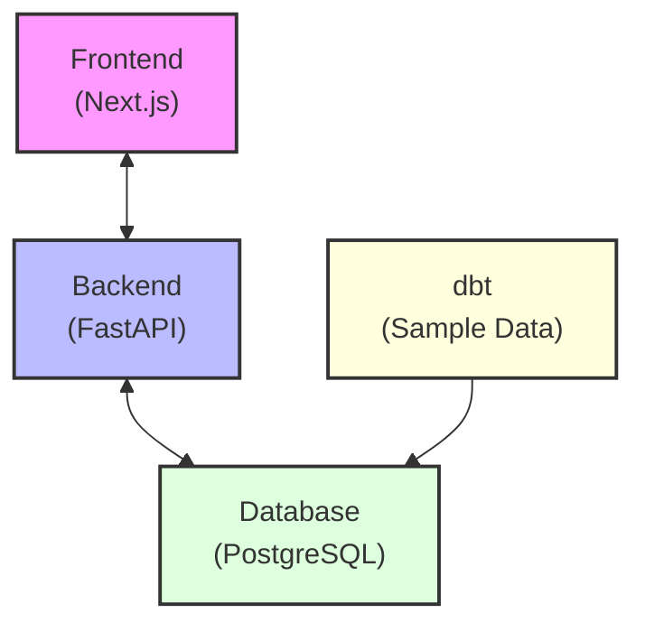
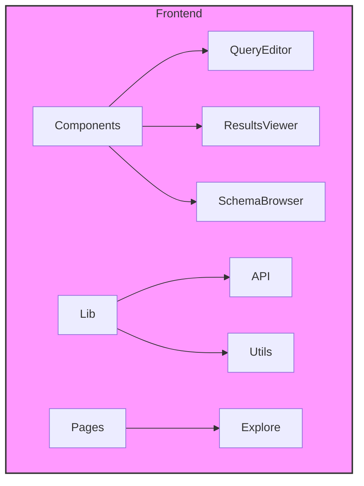
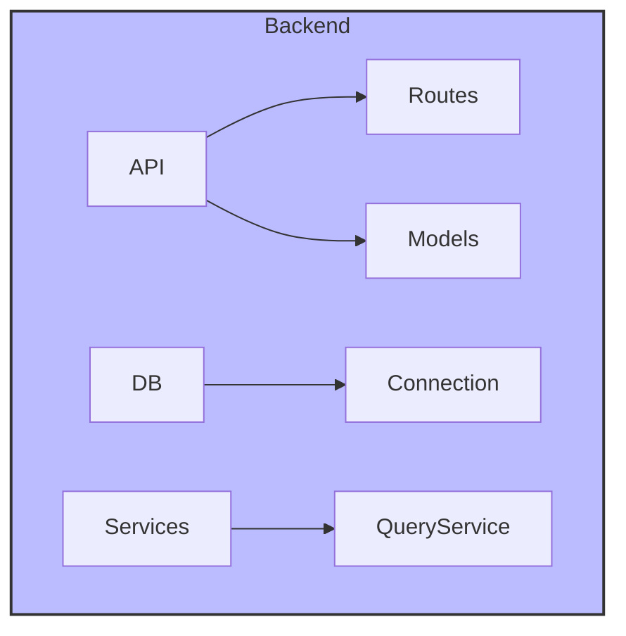
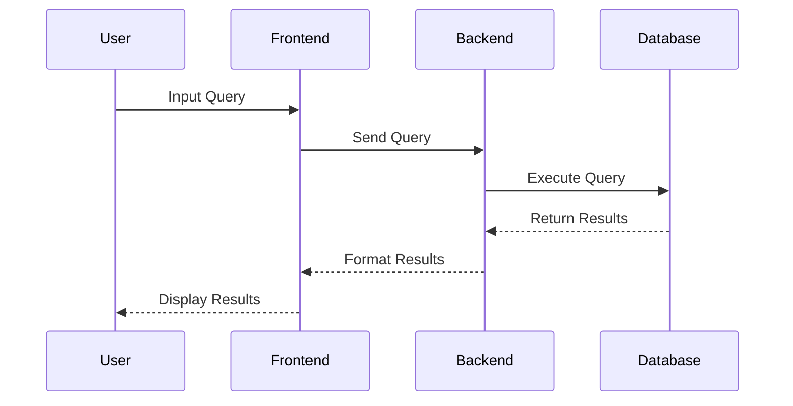
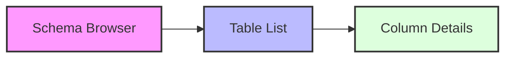

# trove Architecture

This document provides a detailed overview of trove's architecture, components, and their interactions.

## System Overview

trove is built with a modern, microservices-based architecture that prioritizes simplicity and maintainability.

## Component Details

### Frontend (Next.js)
- Modern React-based UI with Next.js
- Tailwind CSS for styling
- TypeScript for type safety
- Core Components:
  - Query Editor
  - Results Viewer
  - Schema Browser

### Backend (FastAPI)
- Async Python with FastAPI
- PostgreSQL connection via asyncpg
- Query execution and management

### Database Layer
- PostgreSQL 15 for data storage
- dbt for sample data seeding
- Basic schema management

## Data Flow

1. **Query Execution Flow**

2. **Data Discovery Flow**

## Technology Stack

### Frontend
- Next.js
- TypeScript
- Tailwind CSS
- CodeMirror (SQL editor)

### Backend
- FastAPI
- asyncpg
- Pydantic

### Data Layer
- PostgreSQL 15
- dbt (for sample data)

### DevOps
- Docker
- Docker Compose
- Make

## Current Limitations

- Basic authentication only
- Single database connection support
- Limited query history
- No saved queries feature yet
- Basic error handling

## Next Steps

See our [GitHub Issues](https://github.com/trove-app/trove/issues) for planned features and improvements. 